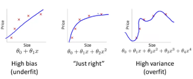

# Machine learning

**Machine learning** is a field of computer science that uses statistical techniques to give computers the ability to "learn" (i.e. progressively improve performance on a specific task) with data.

A machine learning system is trained rather than being explicitly programmed.
It's presented with many examples relevant to a task, and it finds statistical structure in these examples
that eventually allow the system to come up with rules for automating the task.

A machine learning model transforms the input data into meaningful outputs, a process that is "learned" from exposure to known examples of inputs and outputs. Its central problem is therefore to meaningfully transform data, to learn meaningful representations of the data. Learning describes the automatic search process for better representations of the data.

## Two types of machine learning

Machine-learning problems fall into two camps: **supervised** and **unsupervised**.

**Supervised** problems are the ones in which you have access to the target variable.  
Humans input the data and the answers expected from the data, and the machine learning algorithm discovers the rules.

**Unsupervised** problems are ones in which there's no identified target variable.  
The training process tries to find hidden structure in unlabaled data.

## Use cases for supervised machine learning

* **classification**: determine the discrete class to which each individual belongs; examples:
    * spam filtering
    * fraud detection
    * detection of manufacturing defects
* **regression**: predict the real-valued output for each individual; examples: 
    * stock-market prediction
    * demand forecasting
    * weather forecasting
    * sports prediction
    * price estimation
    * risk management
* **recommendation**: predict which alternatives a user would prefer; examples: 
    * product recommendation
    * job recruiting
    * online dating
    * content recommendation
* **imputation**: infer the values of missing input data; examples: 
    * incomplete patient medical records
    * missing customer data

## Use cases for unsupervised learning

* **clustering**: use the input features to discover natural groupings in the data and to divide the data into those groups; methods: k-means, Gaussian mixture models, hierarchical clustering
* **dimensionality reduction**: transform the input features into a small number of coordinates that capture most of the variability of the data; methods: principal component analysis, multidimensional scaling, manifold learning

## More on supervised learning

### Machine learning workflow

* data preparation
* model building
* evaluation
* optimization
* prediction

### Model selection

* data division
    * 60% train set: for training the model
    * 20% dev (cross validation) set: for tuning hyper-parameters
    * 20% test set: for prediction evaluation

### Bias and variance

 $\qquad$ 

* depends on the value of an optimal error for the task at hand, which is usually close to 0% (human performance)
* look at the **error** on the *train set* to determine if you have a **bias problem**
* look at the **error difference** between the *train set* and the *test set* to determine if you have a **variance problem**
* **high bias** (*underfitting*): large train set and test set error, but similar train/test performance
* **high variance** (*overfitting*): small train set error, but large test set error
* high bias and high variance (*underfitting* and *partially overfitting*): large train set error, but even larger test set error
* low bias and low variance (model seems correct): low train set and test set error
* plot the *learning curves* to check if you have an underfitting or an overfitting problem
    * check the error on the train set and on the test set as you increase the size of your train set

     $\qquad$ 

### Bias and variance when using regularization

* bad values of the *regularization term* ($\lambda$) can drive the model to underfit or to overfit the data
* a **high** $\lambda$ penalizes too much the model parameters $\Rightarrow$ **underfitting**
* an intermediate $\lambda$ penalizes just enough the model parameters
* a **low** $\lambda$ doesn't penalize enough the model parameters $\Rightarrow$ **overfitting**
* try various values of $\lambda = \{0, 0.1, 0.2, 0.3, ..., 10\}$
    * compute the train-set error and dev-set error (without using reguarization) for each $\lambda$
    * plot the error curves over all lambda values
    * choose the value of $\lambda$ that minimizes the error on the dev set

    

### Debugging a regularized model

When the model is overfitting (high variance)

* DO 
    * get more training exmples
    * try smaller sets of features
    * try increasing $\lambda$

* DO NOT
    * try getting additional features
    * try adding polynomial features
    * try decreasing $\lambda$

When the model is underfitting (high bias)

* DO
    * try getting additional features
    * try adding polynomial features
    * try decreasing $\lambda$

* DO NOT
    * get more training examples
    * try smaller sets of features
    * try increasing $\lambda$

Additional statements

* a model with many parameters generates a low training set error
* a model trained on a very large training set is unlikely to overfit 

### Error analysis

* start with a simple algorithm that can be implemented quickly
* plot learning curves to decide if it needs more data, more features, ... 
* manually examine the examples on which the algorithm made errors; spot systematic trends on the type of errors
* use a single-number evaluation metric to decide which model works better
