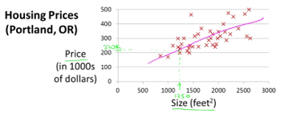
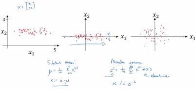

# Linear regression (for regression)

Model a scalar target with one or more quantitative features.  
Although regression computes a linear combination, features can be transformed by nonlinear functions if relationships are known or can be guessed.

## Univariate linear regression

* Description 

    Simple linear regression is a statistical method that studies the relationship between two variables:
    * $x$: the predictor, explanatory, independent variable,
    * $y$: the response, outcome, dependent variable.

* Model's hypothesis

    $h(x) = \theta_0 + \theta_1 \ast x = \hat{y}$

* Model's parameters (# $2$)

    * $\theta_0$, $\theta_1$

* Cost function (in this case, the squared error function)

    $J(\theta_0, \theta_1) = \frac{1}{2m} \sum_{i=1}^{m} \left( \hat{y}^{i} - y^{(i)} \right)^2$

* Goal
    
    $\underset{\theta_0, \theta_1}{\operatorname{min}} J(\theta_0, \theta_1)$

* Algorithm

    * notations

        * $x$: the independent variable
        * $y$: the dependent variable
        * $m$: the number of training examples
        * $x^{(i)}$: the input value of the $i^{th}$ training example
        * $y^{(i)}$: the target value of the $i^{th}$ training example
        * $\hat{y}^{(i)}$: the prediction made on the $i^{th}$ training example by the current hypothesis function 
        * $\alpha$: the learning rate; determines how big steps we take when updating the $\theta$ parameters

    * gradient descent

        * start with some initial values for $\theta_0$ and $\theta_1$ (usually zero)
        * keep changing $\theta_0$ and $\theta_1$ to reduce $J(\theta_0, \theta_1)$

            * $\theta_0 = \theta_0 - \alpha \frac{\partial}{\partial \theta_0} J(\theta_0, \theta_1) = \theta_0 - \alpha \left( \frac{1}{m} \sum_{i=1}^{m} \left( \hat{y}^{i} - y^{(i)} \right) \right)$

            * $\theta_1 = \theta_1 - \alpha \frac{\partial}{\partial \theta_1} J(\theta_0, \theta_1) = \theta_1 - \alpha \left(  \frac{1}{m} \sum_{i=1}^{m} \left(\hat{y}^{i} - y^{(i)} \right) \cdot x^{(i)}\right)$

    * directly use the following **formulas**

        * $\theta_1 = \frac{\sum_{i=1}^{m} (x^{(i)} - \bar{x}) (y^{(i)} - \bar{y})}{\sum_{i=1}^{m} (x^{(i)} - \bar{x})^2}$

        * $\theta_0 = \bar{y} - \theta_1 \bar{x}$

    * hyperparameters

        * $\alpha$: if too small, slow gradient descent; if too large, gradient descent may fail to converge

## Multivariate linear regression

* Description

    Multivariate linear regression is a statistical method that studies the relationship between multiple variables:
    * $n$ variables $x=\{x_1,x_2,...,x_n\}$: the predictor, explanatory, independent variables,
    * one $y$ variable: the response, outcome, dependent variable.

* Model's hypothesis

    $h(x) = \theta_0 + \theta_1 \ast x_1  + \theta_2 \ast x_2 + ... + \theta_n \ast x_n = \hat{y}$

* Model's parameters (# $n+1$)

    $\theta=\{\theta_0, \theta_1, ..., \theta_n\}$

* Cost function (in this case, the squared error function)

    $J(\theta) = \frac{1}{2m} \sum_{i=1}^{m} \left( \hat{y}^{(i)} - y^{(i)} \right)^2$

* Goal

    $\underset{\theta}{\operatorname{min}} J(\theta)$

* Algorithm

    * notations

        * $x$: the independent variables
        * $y$: the dependent variable
        * $m$: the number of training examples
        * $n$: the number of features representing each training example
        * $x^{(i)}$: the input values of the $i^{th}$ training example
        * $x_j^{(i)}$: the value of the $j^{th}$ feature of the $i^{th}$ training example
        * $y^{(i)}$: the target value of the $i^{th}$ training example
        * $\hat{y}^{(i)}$: the prediction made on the $i^{th}$ training example by the current hypothesis function 
        * $\alpha$: the learning rate; determines how big steps we take when updating the $\theta$ parameters

    * gradient descent

        * start with some initial values for $\theta_0$, $\theta_1$, ..., $\theta_n$ (usually $0$)
        * keep changing $\theta$s to reduce $J(\theta)$

            * $\theta_0 = \theta_0 - \alpha \frac{\partial J}{\partial \theta_0} = \theta_0 - \alpha \left( \frac{1}{m} \sum_{i=1}^{m} \left( \hat{y}^{i} - y^{(i)} \right) \right)$

            * $\theta_1 = \theta_1 - \alpha \frac{\partial J}{\partial \theta_1} = \theta_1 - \alpha \left( \frac{1}{m} \sum_{i=1}^{m} \left( \hat{y}^{i} - y^{(i)} \right) \cdot x_1^{(i)}\right)$

            * ...

            * $\theta_n = \theta_n - \alpha \frac{\partial J}{\partial \theta_n} = \theta_n - \alpha \left( \frac{1}{m} \sum_{i=1}^{m} \left( \hat{y}^{i} - y^{(i)} \right) \cdot x_n^{(i)}\right)$

    * hyperparameters

        * $\alpha$

* Performance evaluation

    * $R^2$ regression score: $R^2 = 1 − \frac{\sum_{i=1}^{n} (y_i − \hat{y_i})^2}{\sum_{i=1}^{n} (y_i − \bar{y})^2}$

* Problems

    * make sure features are on similar scales; gradient descent may be slow otherwise

        * feature scaling: $x' = \frac{x - min(x)}{max(x) - min(x)}$

        * feature scaling with mean normalization: $x' = \frac{x - mean(x)}{max(x) - min(x)}$

        * feature scaling with standardization: $x' = \frac{x - mean(x)}{std(x)}$

        

    * make sure the gradient descent is working correctly

        * plot the value of the cost function $J$ over the number of iterations (# $epochs$) 
        * for a sufficiently small $\alpha$, $J(\theta)$ should decrease on every iteration
        * if $\alpha$ is too small, the gradient descent can be slow to converge
        * if $\alpha$ is too large, $J(\theta)$ may not decrease on every iteration; may not converge
        * try values $\alpha \in \{..., 0.001, 0.003, 0.01, 0.03, 0.1, 0.3, 1, ...\}$

    * check model performance

        

        * in case of **underfitting**

            * try adding new features

                * e.g, use a polynomial regression

                    $\theta_0 + \theta_1 \ast x \ \ \ \Rightarrow \ \ \ \theta_0 + \theta_1 \ast x + \theta_2 \ast x^2 + \theta_3 \ast x^3 + \dots$

        * in case of **overfitting**

            * get more training examples

            * try reducing the number of features

                * manually select which features to keep
                * use a model-selection algorithm

            * try getting additional features

            * try adding polynomial features

            * use regularization

                * keep all the features, but reduce the magnitude of parameters $\theta$;  
                  works well when working with a lot of features, each of which contributes a bit to predicting $y$

                * intuition: *shrink* model parameters in order to *smooth out* the decision boundary (generate a *simpler* hypothesis)

                    

                * cost function with the *regularization term*

                    $J(\theta) = \frac{1}{2m} \sum_{i=1}^{m} \left( \hat{y}^{(i)} - y^{(i)} \right)^2 + \frac{\lambda}{2m} \sum_{j=1}^{n} \theta_j^2$

                * parameter update in gradient descent (for $j \in \{1, 2, ..., n\}$)

                    $\theta_j = \theta_j - \alpha \frac{\partial J}{\partial \theta_j} = \theta_j - \alpha \left( \frac{1}{m} \sum_{i=1}^{m} \left( \hat{y}^{i} - y^{(i)} \right) \cdot x_j^{(i)} + \frac{\lambda}{m} \theta_j \right) = \theta_j \left( 1 - \alpha \frac{\lambda}{m} \right) - \alpha \frac{1}{m} \sum_{i=1}^{m} \left( \hat{y}^{i} - y^{(i)} \right) \cdot x_j^{(i)}$

                * $\lambda$ is the *regularization parameter* and needs to be tuned;  
                  it controls the trade-off between the goal of fitting the training data well and the goal of keeping the parameters small;  
                  try values $\lambda \in \{0, 0.02, 0.04, 0.08, 0.16, ..., 10\}$

                  

            * when using regularization, try increasing or decreasing $\lambda$

                  

    * debugging

        * choices to make when dealing with an underfit or an overtfit model

            

        * machine learning diagnostic

            * gain guidance on how to improve the model's performance
            * draw **learning curves**: check the train and dev set error when training on various sizes of the training data set ($1 \le i \le m$)
                * high bias $\Rightarrow$ getting more data won't help
                * high variance $\Rightarrow$ getting more data might help

                 $\quad \quad \quad$
                
