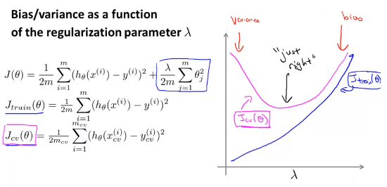

# Logistic regression (for classification)

Categorize observations based on quantitative features.  
Predict target class or probabilities of target classes.

## Binary classification

* Description

    Logistic regression is a statistical method that studies the relationship between multiple variables:
    * $n$ variables $x=\{x_1,x_2,...,x_n\}$: the predictor, explanatory, independent variables,
    * one $y$ variable: the response, outcome, dependent variable.

    Logistic regression expands the linear regression model with a *logistic function* to make it suitable for classification.  
    Its dependent variable is therefore categorical instead of numerical.  
    In case of a binary classification task, its dependent variable takes on one out of two possible values
    * $y \in \{0, 1\}$
    * $0$ indicates the *negative* class
    * $1$ indicates the *positive* class

* Model's hypothesis: output the estimated probability that $y=1$ on input x

    * $z = \theta_0 + \theta_1 \ast x_1  + \theta_2 \ast x_2 + ... + \theta_n \ast x_n$

    * $h_{\theta}(x) = P(y=1|x, \theta) = \sigma(z) = \frac{1}{1 + \mathrm{e}^{-z}} = \hat{y}\ \ \ $ ($0 <= h(x) <= 1$)

    * Note: $\sigma(z) \ge 0.5$ when $z \ge 0$ 

* Model's parameters (# $n+1$)

    $\theta=\{\theta_0, \theta_1, ..., \theta_n\}$

* Decision boundary

    * linear

    * non-linear when adding extra higher-order polynomial terms to the features

* Cost function

    $J(\theta) = \frac{1}{m} \sum_{i=1}^{m} \left( -y^{(i)}\ log\ \hat{y}^{(i)} - (1 - y^{(i)})\ log\ (1 - \hat{y}^{(i)}) \right)$

    in other words

    * $J(\theta) = \frac{1}{m} \sum_{i=1}^{m} \left( -\ log\ \hat{y}^{(i)} \right)$ when $y^{(i)}=1$
    * $J(\theta) = \frac{1}{m} \sum_{i=1}^{m} \left( -\ log\ (1 - \hat{y}^{(i)}) \right)$ when $y^{(i)}=0$

    

    intuition

    * when $y=1$ and $\hat{y} \rightarrow 0$ then $J(\theta) \rightarrow \infty$

    * when $y=0$ and $\hat{y} \rightarrow 1$ then $J(\theta) \rightarrow \infty$

* Goal
    
    $\underset{\theta}{\operatorname{min}} J(\theta)$

* Algorithm

    * gradient descent

        * start with some initial values for $\theta_0$, $\theta_1$, ..., $\theta_n$ (usually normal random values)
        * keep changing $\theta$s to reduce $J(\theta)$

            * $\theta_0 = \theta_0 - \alpha \frac{\partial J}{\partial \theta_0} = \theta_0 - \alpha \left( \frac{1}{m} \sum_{i=1}^{m} \left( \hat{y}^{i} - y^{(i)} \right) \right)$

            * $\theta_1 = \theta_1 - \alpha \frac{\partial J}{\partial \theta_1} = \theta_1 - \alpha \left( \frac{1}{m} \sum_{i=1}^{m} \left( \hat{y}^{i} - y^{(i)} \right) \cdot x_1^{(i)}\right)$

            * ...

            * $\theta_n = \theta_n - \alpha \frac{\partial J}{\partial \theta_n} = \theta_n - \alpha \left( \frac{1}{m} \sum_{i=1}^{m} \left( \hat{y}^{i} - y^{(i)} \right) \cdot x_n^{(i)}\right)$

    * hyperparameters

        * $\alpha$

* Performance evaluation

    * accuracy: out of all predictions, how many of them were correct
    * precision: out of all *positive* predictions, how many of them were actually *positive* examples
    * recall: out of all positive examples, how many of them were detected as positive
    * f1-score: harmonic mean between precision and recall

* Problems

    * feature scaling is also important for logistic regression
    
        * feature scaling: $x' = \frac{x - min(x)}{max(x) - min(x)}$

        * feature scaling with mean normalization: $x' = \frac{x - mean(x)}{max(x) - min(x)}$

        * feature scaling with standardization: $x' = \frac{x - mean(x)}{std(x)}$

    * make sure the gradient descent is working correctly

        * plot the value of the cost function $J$ over the number of iterations (# epochs)
        * for a sufficiently small $\alpha$, $J(\theta)$ should decrease on every iteration
        * if $\alpha$ is too small, the gradient descent can be slow to converge
        * if $\alpha$ is too large, $J(\theta)$ may not decrease on every iteration; may not converge
        * try values $\alpha \in \{...,0.001,0.003,0.01,0.03,0.1,0.3,1,...\}$

    * check model performance

        

        * in case of **underfitting**

            * try adding new features

                * e.g, use a polynomial regression

                    $\theta_0 + \theta_1 \ast x \ \ \ \Rightarrow \ \ \ \theta_0 + \theta_1 \ast x + \theta_2 \ast x^2 + \theta_3 \ast x^3 + \dots$

        * in case of **overfitting**

            * reduce the number of features

                * manually select which features to keep
                * use a model-selection algorithm

            * use regularization

                * keep all the features, but reduce the magnitude of parameters $\theta$;  
                  works well when working with a lot of features, each of which contributes a bit to predicting $y$

                * intuition: *shrink* model parameters in order to *smooth out* the decision boundary (generate a *simpler* hypothesis)

                    

                * cost function with the regularization term

                    $J(\theta) = \frac{1}{m} \sum_{i=1}^{m} \left( -y^{(i)}\ log\ \hat{y}^{(i)} - (1 - y^{(i)})\ log\ (1 - \hat{y}^{(i)}) \right) + \frac{\lambda}{2m} \sum_{j=1}^{n} \theta_j^2$

                * parameter update in gradient descent (for $j \in \{1, 2, ..., n\}$)

                    $\theta_j = \theta_j - \alpha \frac{\partial J}{\partial \theta_j} = \theta_j - \alpha \left( \frac{1}{m} \sum_{i=1}^{m} \left( \hat{y}^{i} - y^{(i)} \right) \cdot x_j^{(i)} + \frac{\lambda}{m} \theta_j \right) = \theta_j \left( 1 - \alpha \frac{\lambda}{m} \right) - \alpha \frac{1}{m} \sum_{i=1}^{m} \left( \hat{y}^{i} - y^{(i)} \right) \cdot x_j^{(i)}$

                * $\lambda$ is the *regularization parameter* and needs to be tuned;  
                  it controls the trade-off between the goal of fitting the training data well and the goal of keeping the parameters small;  
                  try values $\lambda \in \{0, 0.02, 0.04, 0.08, 0.16, ..., 10\}$

            * when using regularization, try increasing or decreasing $\lambda$

                  

    * debugging

        * choices to make when dealing with an underfit or an overtfit model

            

        * machine learning diagnostic

            * gain guidance on how to improve the model's performance
            * draw **learning curves**: check the train and dev set error when training on various sizes of the training data set ($1 \le i \le m$)
                * high bias $\Rightarrow$ getting more data won't help
                * high variance $\Rightarrow$ getting more data might help

                 $\quad \quad \quad$
                

* Trading off precision and recall

    * use a different threshold for making decisions whether the class is positive or negative
    * minimize the number of false positives
        * generate a higher precision, but a lower recall
        * choose a higher threshold (e.g. $\sigma=\{0.7, ..., 0.9\}$)
    * minimize the number of false negatives
        * generate a higher recall, but a lower precision
        * choose a lower threshold (e.g. $\sigma=\{0.1, ..., 0.3\}$)
    * plot the precision-recall tradeoff curve by testing various threshold values between $[0, 1]$

## Multiclass classification

* Description

    * use the one-vs-all (one-vs-rest) approach
    * turn the problem into $C$ binary classification problems (generate $C$ decision boundaries)
    * formally: train a logistic regression classifier $h^{(i)}(x)$ for each class $i$ to predict the probability that $y=i$
    * on a new input $x$, in order to make a prediction pick the class $i$ that maximizes the class probability $\underset{i}{\operatorname{max}}  h^{(i)}(x)$

    
