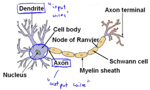
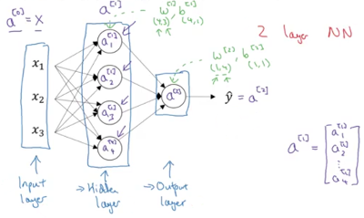
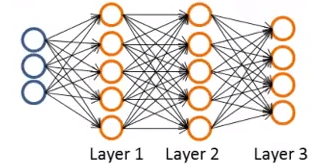
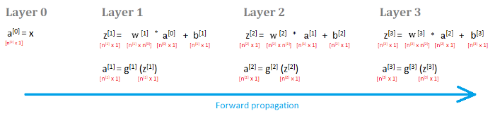
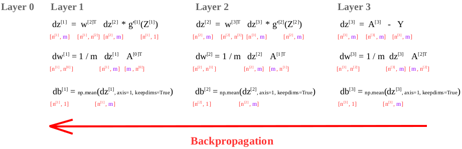

# Neural networks (for classification or regression)

Used to estimate unknown functions (complex, non-linear hypothesis) that are based on a large number of inputs, through the back-propagation algorithm.  
Generally more complex and computationally expensive than other methods, but powerful for certain problems.  
The basis of many deep learning methods.  
Today is the state of the art technique for many different machine learning problems.

## Description

Neural networks were developed to vaguely simulate the neurons in the brain.

A neuron is a computational unit that receives a number of inputs through its input wires (*dendrites*),  
does some computation and then sends signals through its output wire (*axon*) to other neurons in the brain.  

A neural network is a group of neurons.  
The inputs are grouped in an *input layer*.  
The outputs are grouped in a final *output layer*.  
The layers in between are called the *hidden layers*.  
Adding more layers helps computing even more complex functions on the input data.

## Notation

* training set $X = \left\{(x^{(1)}, y^{(1)}), (x^{(2)}, y^{(2)}), ..., (x^{(m)}, y^{(m)})\right\}$ with $m$ training samples

* each input variable has $n$ features: $x^{(i)}=\{x_1^{(i)}, x_2^{(i)}, ..., x_n^{(i)}\}$

* output variable $y^{(i)}$, represented by either a single value (in case of regression or binary classification) or by an identity vector (in case of multi-class classification)

* $L$: the total number of layers in the network (comprising the hidden layers and the output layer)

* $n^{[l]}$: the number of units (neurons) in layer $l$

* $w^{[l]}$: weights matrix $\left[ n^{[l]},\ n^{[l-1]} \right]$ controlling function mapping from layer $l-1$ to layer $l$; $w_{ij}^{[l]}$: weight to unit $i$ in layer $l$ from unit $j$ in layer $l-1$

* $b^{[l]}$: bias vector $\left[ n^{[l]},\ 1 \right]$ on layer $l$; $b_{i}^{[l]}$: bias on unit $i$ in layer $l$

* activation values outputed from layer $l$

    $z^{[l]} = w^{[l]} a^{[l-1]} + b^{[l]}$

    $a^{[l]} = g^{[l]}(z^{[l]})$

* in detail for each unit in the layer

    $z_j^{[l]} = w_{j0}^{[l]} a_0^{[l-1]} + w_{j1}^{[l]} a_1^{[l-1]} + ... + w_{jn^{[l-1]}}^{[l]} a_{n^{[l-1]}}^{[l-1]} + b_j^{[l]}$

    $a_j^{[l]} = g^{[l]}(z_j^{[l]})$

* output $\hat{y} = a^{[L]} = h(x)$

## Neural networks for multi-class classification

* Model's architecture

    * fully connected network
    * $L=3$ layers
    * input layer with $n=3$ units (a training sample $x$)
    * output layer with $K=4$ units ($\hat{y} = h_{\Theta}(x) \in \mathbb{R}^{K}$)
    * $L-1=2$ hidden layers with $n^{[l]}=5$ units (for $l \in \{1,...,L-1\}$)

    

* Model's parameters

    * $w=\left\{ w^{[1]}, w^{[2]}, ..., w^{[L]} \right\}$
    * $b=\left\{ b^{[1]}, b^{[2]}, ..., b^{[L]} \right\}$

* Data

    * $X = \left[ n,\ m \right]$ matrix
    * $Y = \left[ K,\ m \right]$ matrix

* Cost function (for the softmax activation function)

    $J(w, b) = \frac{1}{m} \sum_{i=1}^{m} \mathscr{L}(\hat{y}, y) = \frac{1}{m} \sum_{i=1}^{m} \sum_{k=1}^{K} \left( -y_k^{(i)}\ log\ \hat{y}_k^{(i)}\right)$

* Goal

    $\underset{w, b}{\operatorname{min}} J(w, b)$

* Algorithm (vectorized implementation)

    * initialize the model parameters

        * $w^{[l]} = np.random.randn(n^{[l]}, n^{[l-1]}) * 0.01$ for $l=1, ..., L$
        * $b^{[l]} = np.zeros((n^{[l]}, 1))$

    * for each epoch
    
        * set $A^{[0]} = X$

        * perform forward-propagation to compute $A^{[l]}$ for $l=\{1, 2, ..., L\}$

            

            * $Z^{[l]} = w^{[l]} A^{[l-1]} + b^{[l]}$
            * $A^{[l]} = g^{[l]}(Z^{[l]})$

        * perform back-propagation: back propagate the error through each layer

            

            * last layer

                $dz^{[L]} = \frac{\partial \ J}{\partial \ Z^{[l]}} = A^{[L]} - Y$

                $dw^{[L]} = \frac{\partial \ J}{\partial \ w^{[L]}} = \frac{1}{m} dz^{[L]} A^{[L-1]^T}$

                $db^{[L]} = \frac{\partial \ J}{\partial b^{[L]}} = np.mean(dz^{[L]}, axis=1, keepdims=True)$

            * previous layers

                $dz^{[l]} = w^{[l+1]^T} dz^{[l+1]} * g'^{[l]}(Z^{[l]})$

                $dw^{[l]} = \frac{1}{m} dz^{[l]} A^{[l-1]^T}$

                $db^{[l]} = np.mean(dz^{[l]}, axis=1, keepdims=True)$

            * update the weights and biases for every layer

                $w^{[l]} = w^{[l]} - \alpha \ dw^{[l]}$

                $b^{[l]} = b^{[l]} - \alpha \ db^{[l]}$
