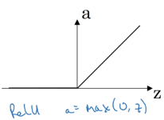

# Activation functions in neural networks

## Sigmoid / Logistic function

  

Description

* $g(z) = \sigma(z) = \frac{1}{1+\mathrm{e}^{-z}}$; $g'(z)=g(z)\left( 1 - g(z) \right)$
* squashes numbers to range [0, 1]  
  high values near 1, high negative values near 0
* has a nice interpretation of saturating the "firing rate" of a neuron

Problems

* saturated neurons "kill" the gradient  
  high positive and high negative values generate ~0 gradients (flat slope)
* sigmoid outputs are not zero-centered (inneficient gradient updates)
* the exponential function is computationally expensive

## Tanh 

  

Description

* $g(z) = tanh(z) = \frac{\mathrm{e}^{z} - \mathrm{e}^{-z}}{\mathrm{e}^{z} + \mathrm{e}^{-z}}$; $g'(z) = 1 - g(z)^2$
* squashes numbers to range [-1, 1]  
  high values near 1, high negative values near -1
* outputs are zero-centered

Problems

* saturated neurons "kill" the gradient

## ReLU (REctified Linear Unit)

  

Description

* $g(z) = max(0, z)$; $g'(z)=0$ if $z \lt 0$, $g'(z)=1$ if $z \gt 0$
* does not saturate in the positive region
* very computationally efficient
* converges much faster than sigmoid/tanh in practice

Problems

* not zero-centered output
* saturated neurons in the negative region
* dead ReLUs will never activate and therefore will never update

## Leaky ReLU

  

Description

* $g(z) = max(0.01 z, z)$; $g'(z)=0.01$ if $z \lt 0$, $g'(z)=1$ if $z \gt 0$
* does not saturate
* computationally efficient
* converges faster than sigmoid/tanh in practice
* will not die

## Softmax function

Description

* $g(z_j) = \frac{\mathrm{e}^{z_j}}{\sum_{k=1}^{K} \mathrm{e}^{z_k}}$ for $j=1,2,...,K$
* used as the output activation function in a multiclass classification problem
* is a generalization of the logistic function
* squashes a $K$-dimensional vector $z$ of arbitrary real values to an other $K$-dimensional vector of real values, where each entry is in the range [0, 1] and all entries sum up to 1
